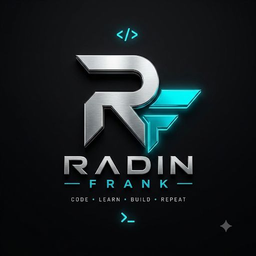

  

  

<h1 align="center">Radin (Frank) 👨‍💻</h1>

  <b>Software Engineer</b> • <b>Cybersecurity Researcher</b> • <b>Open Source Developer</b>

  <i>Building secure, clean and scalable software.</i>

  🔒 Privacy-focused • 🧠 Security mindset • ⚙️ System builder

---

## 🧠 About Me

- 💻 I design and build software systems
- 🔐 Focused on cybersecurity & vulnerability research
- 🚀 Passionate about open-source development
- 🌍 Always learning, always improving

---

## 🛠️ Tech Stack

**Languages**
- Python • Java • Kotlin • JavaScript • C • C++ • PHP • HTML • CSS

**Focus Areas**
- Backend Development
- Cyber Security
- Automation & Tools
- Open Source Projects

---

## 📬 Connect With Me

💬 Rubika → [@Frank_info](https://rubika.ir/Frank_info)  
✈️ Telegram → [@TeFrank](https://t.me/TeFrank)  
📧 Email → **Radin.Karimi.pro@gmail.com**

---

## 📊 GitHub Analytics

  

  

  

---

  <b>IRAN</b>

